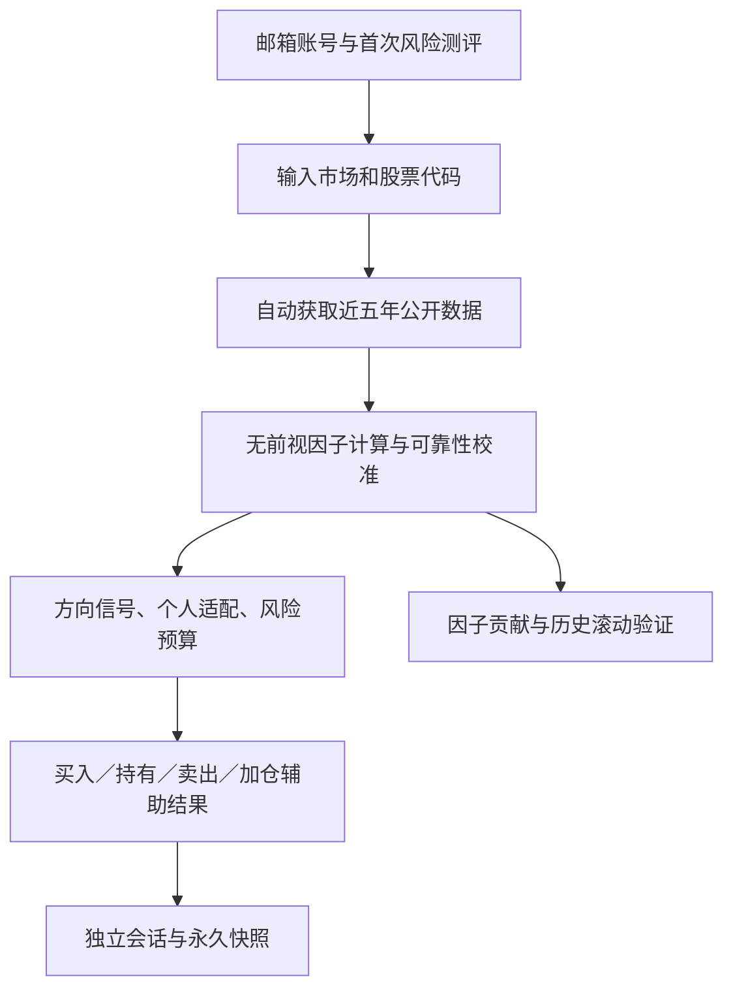

# 个人投资者股票决策辅助 Agent｜数据渠道稳定版 V6.5.2

这是一个面向 A股、美股和港股个人投资者的股票决策辅助系统。项目通过真实公开行情、基本面、宏观环境、最新公开资讯、个人风险画像、历史相似状态和持仓记录的联合分析，实现股票与个人的适配判断、持有周期选择、风险预算、卖出信号和加仓条件分析，从而缓解信息分散、判断口径不一致、风险承受能力与股票风险错配以及历史结果难以复盘等问题。

> 该分析结果仅供参考，本模型仅用于学习与研究，不构成投资建议，不连接券商，也不执行真实交易。

## 项目要解决的问题

| 用户痛点 | Agent如何处理 | 形成的结果 |
| --- | --- | --- |
| 不知道一只股票是否适合自己 | 将用户风险等级、资金用途、资产区间与股票风险等级联合判断 | 适配、有限适配、不适配或证据不足 |
| 行情、财务、宏观和资讯分散 | 自动拉取并整理真实公开数据，同时标明来源与缺失项 | 一页式证据链，不要求用户手动整理Excel |
| 不知道应持有多久 | 先根据用款时间、目标、看盘条件和纪律确定周期，再评估该周期信号 | 持有／复核周期与独立方向判断 |
| 容易只看一段上涨历史 | 固定使用最近五年；上市不足五年时使用全部可得历史并降低置信度 | 降低人为选择样本区间造成的偏差 |
| 想知道类似行情之后发生过什么 | 用收益、波动、回撤、均线、成交量和市场状态检索历史相似时点 | 后续收益分布、上涨样本占比、路径和可信度 |
| 已持有后不知道何时复核或卖出 | 检查个人亏损边界、趋势破位、盈利回撤、相对弱势、基本面恶化和相似周期转弱 | 继续持有、警戒观察、分批减仓或退出复核信号 |
| 想加仓但不知道是否合适 | 叠加个人适配、时点、资讯、剩余风险预算、组合集中度和现有卖出信号 | 可小额分批、满足条件再考虑或暂不适合加仓 |
| 同时关注多只股票，容易忘记历史结果 | 每只股票建立独立会话，并永久保存历次分析、买入和加仓记录 | 跨设备恢复、历史版本复盘和会话组合占比 |
| 看到了结论，却不知道分数如何形成 | 展示每项因子的当前值、贡献分、公式、权重和缺失规则 | 可审计的“因子贡献解释” |
| 不知道因子过去是否有效 | 使用历史时点可见数据进行无前视滚动验证 | IC、方向命中率、分组收益差及保留／降权／候选删除建议 |
| 个人适配被误解为“股票会涨” | 将用户适配、股票风险和行情方向分开 | 三个独立结果，不再相互代替 |

## 核心流程



## V6.5.2 修复：数据通道失败不再冒充“证据不足”

V6.5.2不改变V6.5.1的因子权重和正式判断阈值，重点修复公开数据通道和错误降级：

- A股、美股、港股行情优先使用快速公开图表接口，并保留第二图表节点、yfinance、BaoStock、东方财富、Stooq和新浪等备用路径。
- A股财务从单一BaoStock扩展为BaoStock与东方财富双通道；美股使用SEC、东方财富和Yahoo；港股使用Yahoo与东方财富。
- 财务、宏观、资讯和因子解释属于辅助模块。任一模块失败时只跳过该项，不再终止核心量价分析。
- 页面将“行情数据不足”和“数据接口／程序运行失败”分开显示，不再把所有异常统一写成“证据不足”。
- 页面标题直接显示 `V6.5.2`，便于确认GitHub中的 `app.py` 与 `agent_core.py` 已同步覆盖。
- 使用20只A股、20只美股、20只港股完成60只真实股票压力测试，并故意关闭全部辅助证据；60只均形成结论，证据不足率为0%。

逐项结果见 `validation_output/60只股票逐项测试结果_V6.5.2.csv`。

## V6.5.1 修复：恢复正常判断

V6.5.1修复了V6.5把历史验证设置为硬闸门的问题。只要股票价格、成交量和所需周期窗口可得，Agent就会形成行情判断；历史验证较弱只会降低权重和可信度。

- “个人适配”只回答用户能否承受该股票的风险，不再代表股价将上涨。
- “行情方向”和“个人适配”分别输出；个人不适配不会隐藏股票行情判断。
- 价格与快均线、快慢均线由两次重复计分合并为一个趋势块，最高±10分。
- 动量和相对强弱按近期波动率标准化，避免高波动股因涨跌幅绝对值较大而长期占优。
- 成交量改为趋势确认和流动性提示，正式方向权重为0。
- 相似周期改为情景展示，正式方向权重为0，不再直接修正买入分。
- 基本面只对中长期作有限修正，宏观修正上限降至±2分。
- 先根据用户的资金期限、目标和执行能力选择持有期，不再从多个周期中挑当前得分最高的一个。
- 财务、宏观、资讯和相似周期属于可选证据；缺失时该项跳过，不会导致整只股票“证据不足”。
- 只有连可用持有周期所需的核心行情都不足时，才允许显示“证据不足”。

校准说明见 [因子校准说明_V6.5.md](因子校准说明_V6.5.md)。

## V6.4 新增：因子透明与历史验证

V6.4 只新增解释与验证能力，不改动 V6.3 原有生产评分、行情、资讯、适配、仓位、卖出、加仓或永久保存逻辑。

- 结果页新增 **“因子解释与验证”** 标签。
- 展示本次用户风险分、股票风险分和所选持有期时点分的逐项贡献。
- 所有价格、百分数、贡献分和验证指标按三位小数展示。
- 内置 **85项因子与业务规则** 的完整字典，逐项记录：计算公式、数据要求、方向、当前权重和缺失处理。
- 对能够从日线历史无前视还原的因子执行滚动验证：秩相关 IC、方向命中率、因子高低20%组的后续收益中位数差、前后半段 IC 稳定性和因子相关性。
- 根据当前股票与当前持有期的历史样本，给出“保留、降低权重、候选删除”建议。
- 建议不会自动改写生产权重。只有经过 A股、美股、港股多标的、样本外复核后，才应在下一版本正式调整。
- 基本面、宏观和资讯若缺少历史时点快照，不使用今天的数据回填过去，避免前视偏差；这些因子暂不参加历史删减裁决。

完整说明见 [因子字典与历史验证_V6.4.md](因子字典与历史验证_V6.4.md)。程序中的可执行字典位于 `factor_analysis.py`，网页展示与文档口径均以该文件为准。

## 当前模型的因子结构

| 模块 | 数量 | 主要内容 | 在模型中的作用 |
| --- | ---: | --- | --- |
| 用户风险分 | 8 | 资金来源、应急储备、用款时间、亏损反应、损失上限、目标、收入、经验 | 形成 C1—C5 |
| 周期选择约束 | 3 | 交易频率、看盘时间、退出纪律 | 判断短周期是否可执行 |
| 适配与仓位 | 9 | 资产区间、集中度、风险等级差、风险预算、压力损失和时点乘数等 | 形成适配和仓位上限 |
| 问卷保留项 | 1 | 外汇波动接受度 | 当前记录展示，待汇率适配深化 |
| 股票风险分 | 4 | 年化波动、最大回撤、下行波动、Beta | 形成 R2—R5 |
| 基本面评分 | 7 | ROE、净利率、利润增长、营收增长、负债率、现金流覆盖、PE | 中长期修正 |
| 宏观与市场 | 3 | 基准趋势、基准波动、公开利率方向 | 市场环境修正 |
| 持有期时点评分 | 10 | 均线、动量、相对收益、成交量、基本面、宏观、相似周期、资讯等 | 多期限评分 |
| 最新资讯修正 | 5 | 情绪、相关度、时效、来源、可信度闸门 | 最多±8分辅助修正 |
| 相似周期距离 | 16 | 多期限收益、波动、回撤、均线、量比、相对市场等 | 检索历史相似状态 |
| 数据完整度 | 6 | 历史长度、新鲜度、Beta、基本面、宏观和异常日 | 控制结论可信度 |
| 卖出信号 | 6 | 亏损边界、趋势、盈利保护、相对弱势、基本面和相似周期 | 已持有后的复核信号 |
| 加仓条件分 | 7 | 时点、适配、卖出状态、预算、数据、硬限制和集中度 | 加仓适配分析 |
| **合计** | **85** | 预测因子、适配规则和安全约束分层管理 | 不把风险控制误称为涨跌预测 |

## 历史验证方法

对于所选持有期为 `h` 个交易日的情况：

1. 在历史时点 `t` 只使用 `t` 及以前的数据计算因子；
2. 以 `P(t+h) / P(t) - 1` 作为该时点的后续收益；
3. 每隔 `max(5, round(h/4))` 个交易日抽取一个验证时点，减少样本高度重叠；
4. 计算：
   - `IC = Corr(rank(factor_t), rank(return_t,t+h))`；
   - `方向命中率 = mean(sign(factor_t) = sign(return_t,t+h))`；
   - `高低组收益差 = median(return | factor前20%) - median(return | factor后20%)`；
   - 前后半段 IC，用于检查方向稳定性；
5. 当两个因子的历史秩相关绝对值不低于0.850时，较弱因子优先建议降低权重，而不是自动删除。

历史建议的默认口径：

- **保留**：IC、方向命中、分组收益和前后半段方向均较稳定；
- **降低权重**：预测力较弱、方向不稳定、分组收益未拉开或与其他因子高度重复；
- **候选删除**：IC≤-0.050、命中率<47%、高低组收益差为负，且前后半段 IC 均为负；仍需多股票样本外复核；
- 有效独立时点少于30个时不依据小样本自动改权。

## 数据规则与边界

- 行情统一使用分析日向前最近五年；上市不足五年时使用上市以来全部可得数据并降低可信度，但周期窗口足够时继续判断。
- A股、美股和港股使用真实公开日线，并与对应市场基准比较。
- 一日判断需要分钟级或实时数据；当前免费日线不能可靠完成，因此不强行输出方向。
- 最新资讯默认检索最近7天；不足时扩大到30天。资讯最多修正±8分，不改变用户等级、股票风险等级和硬性安全限制。
- 相似周期只用于展示历史情景，V6.5正式方向权重为0；样本不足时明确显示限制，不伪造预测。
- 历史上涨样本占比不是经过校准的上涨概率，历史表现也不保证未来结果。
- 基本面与资讯可能存在延迟、缺失或口径差异，重大事项应以交易所、监管机构和公司正式披露为准。

## 永久会话与持仓口径

- 使用 Supabase Auth 完成邮箱注册、验证码和密码登录。
- 风险测评、问卷草稿、股票会话、历次完整分析、买入／加仓记录永久保存。
- 每只股票一个独立会话，可恢复第一次或之后任意一次分析快照。
- 持仓占比只读取当前账号内仍保留会话的有效投入本金。
- 删除某只股票会话在业务上等价于该股票已全部卖出，之后不再参与持仓统计。
- 登记计划加仓只保存测算；只有真实成交后再次登记，才更新本金、股数和持仓占比。

## 项目文件

| 文件 | 用途 |
| --- | --- |
| `app.py` | Streamlit 页面、账户流程和结果展示 |
| `agent_core.py` | V6.5.2 多数据通道、量化、风险、可靠性校准、周期、适配、仓位和卖出逻辑 |
| `factor_analysis.py` | 85项因子字典、贡献解释和历史滚动验证 |
| `news_analysis.py` | 最新公开资讯获取、相关度、情绪和有限修正 |
| `add_position_analysis.py` | 已持仓股票的加仓适配分析 |
| `questionnaire.py` | 14题风险问卷与个人画像 |
| `cloud_store.py` | Supabase账户和永久数据访问 |
| `session_memory.py` | 股票会话、投入本金与组合口径 |
| `snapshot_codec.py` | 完整分析快照序列化与恢复 |
| `一键建表_V6.0.sql` | 首次部署数据库表、RLS与权限 |
| `historical_test_tool/` | 与正式页面分开的历史时点复现工具，只读取T日及以前数据 |
| `test_v5.py`—`test_v652.py` | 原有功能、因子模块、数据降级和V6.5.2稳定性回归测试 |
| `batch_acceptance_v652.py` | 60只真实股票的证据不足率验收程序 |

## 首次部署

详细步骤见 [GitHub部署说明_V6.5.md](GitHub部署说明_V6.5.md)。概要如下：

1. 将本项目文件上传至 GitHub 仓库；
2. 首次部署时在 Supabase SQL Editor 完整运行 `一键建表_V6.0.sql`；
3. 在 Streamlit Community Cloud 的 **App settings → Secrets** 填写：

```toml
SUPABASE_URL = "你的 Project URL"
SUPABASE_PUBLISHABLE_KEY = "你的 Publishable key"
```

不要填写 `secret key` 或 `service_role key`，不要把真实密钥上传到 GitHub。

## 覆盖升级到 V6.5.2

在原 GitHub 仓库执行一次覆盖上传：

1. 覆盖 `agent_core.py`、`factor_analysis.py`、`add_position_analysis.py`、`news_analysis.py`、`app.py` 和 `README.md`；
2. 新增 `test_v652.py`、`batch_acceptance_v652.py`、`版本更新清单_V6.5.2.md` 和 `validation_output/`；
3. 保留其他现有文件；
4. 等待 Streamlit 自动重启，再重新分析任意股票；
5. 检查页面标题必须显示 **数据渠道稳定版 V6.5.2**，并确认结果页分别显示 **行情方向、方向可信度、个人适配**。

本次无需重新运行 SQL，无需修改 Streamlit Secrets，无需重新设置邮箱验证码，也不会删除已保存的账号、风险资料、股票会话、分析快照、真实持仓或加仓记录。

## 本地运行（可选）

```bash
python -m pip install --upgrade -r requirements.txt
streamlit run app.py
```

本地运行时把真实配置放入 `.streamlit/secrets.toml`；该文件已被 `.gitignore` 排除。

## 主要迭代过程

| 阶段 | 主要改进 |
| --- | --- |
| V1 | Excel样例数据、基础风险问卷和单股判断原型 |
| V2 | 改为输入股票代码后自动获取真实公开行情，支持A股与美股 |
| V3—V3.2 | 修复股票代码切换、数据源失败和历史窗口问题；改为Agent自动选择历史范围 |
| V4 | 扩大到不同经验层级投资者，重构个人适配、周期和仓位逻辑 |
| V5—V5.1 | 统一最近五年规则，加入港股、分页风险问卷、个人中心和页面优化 |
| V5.2 | 改进相似周期样本、市场基准降级、历史路径和滚动验证；补充卖出信号 |
| V6.0 | 邮箱账号、跨设备永久保存、独立股票会话、完整快照、真实买入／加仓登记和组合占比 |
| V6.1 | 邮箱验证码注册与自定义SMTP流程 |
| V6.2 | 已持仓股票加仓适配分析，并永久保存加仓判断 |
| V6.3 | 融合最新公开资讯，显示来源、标题、时间、摘要和原文链接，最多±8分辅助修正 |
| V6.4 | 完整因子字典、逐项贡献解释、无前视滚动验证和因子保留／降权／候选删除建议 |
| V6.5 | 重复趋势合并、动量波动率标准化、成交量与相似周期退出正式方向分、历史闸门、适配与方向分离 |
| V6.5.1 | 将历史硬闸门改为软校准；缺失可选因子不阻断；恢复行情判断并继续独立显示个人适配 |
| V6.5.2 | 增加跨市场行情与财务备用源；辅助模块失败自动降级；区分接口错误与证据不足；60只真实股票压力测试证据不足率0% |

## 免责声明

该分析结果仅供参考，本模型仅用于学习与研究。
